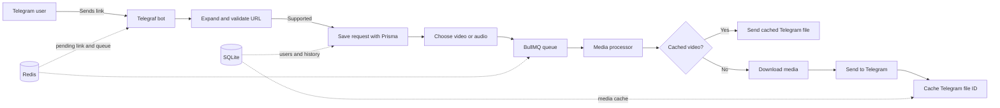

<div align="center">

# Telegram Media Downloader Bot

### Send a social media link to Telegram and get the video back in chat.

Built with NestJS, Telegraf, BullMQ, Redis, and Prisma.


</div>

---

## What it does

Send a link from TikTok, Reddit, Instagram, or YouTube to the bot. The bot checks the URL, asks for a video or audio choice, and puts the request on a background queue. When processing finishes, the media is sent to the same Telegram chat.

The bot also records users and submitted links in SQLite, keeps pending links in Redis, and caches Telegram video file IDs so a previously processed video can be sent again without downloading it.

## How a request moves through the app



## Supported platforms

| Platform | Link handling |
| --- | --- |
| TikTok | Regular links and `vt.tiktok.com` short links |
| Reddit | `reddit.com` links |
| Instagram | `instagram.com` links |
| YouTube | Recognized by the validator |

The current bot reply lists TikTok, Reddit, and Instagram as supported. YouTube is recognized internally, but its end-to-end behavior has not been confirmed.

## Quick start

### Requirements

- Node.js 24 and npm
- Redis 7
- A Telegram bot token from [@BotFather](https://t.me/BotFather)
- FFmpeg for media processing (included in the Docker image)

### Configure the bot

Create `backend/.env`:

```dotenv
TELEGRAM_BOT_TOKEN=your-telegram-bot-token
DATABASE_URL=file:./dev.db

```

Keep this file private and out of version control.

### Run with Docker Compose

The application connects to Redis at `redis:6379`. Before starting Compose, pass the backend environment file to the `bot` service by adding this under `bot` in `docker-compose.yml`:

```yaml
    env_file:
      - ./backend/.env
```

Then start the services:

```bash
docker compose up --build
```

Compose starts Redis and the bot. The HTTP service listens on port `3000`; the bot receives messages through the Telegram Bot API. The current Compose setup does not persist the SQLite database across container replacement.

### Run locally

The backend currently uses the Redis hostname `redis` for both BullMQ and its link cache. Run Redis with that hostname reachable from your backend, or change the Redis host in `backend/src/app.module.ts` to match your local Redis instance.

From the repository root:

```bash
cd backend
npm ci --legacy-peer-deps
npx prisma generate
npx prisma migrate deploy
npm run start:dev
```

Message `/start` to your bot, then send a supported link and choose a format.

## Bot commands

| Command / message | What happens |
| --- | --- |
| `/start` | Creates or finds your user record and explains the link workflow |
| `/stats` | Shows recorded requests, grouped by platform |
| A supported URL | Validates and records the link, then offers format buttons |

## Architecture

| Component | Responsibility |
| --- | --- |
| NestJS + Telegraf | Telegram commands, messages, and callback buttons |
| Link validator | Resolves a URL host to a supported platform |
| BullMQ + Redis | Queues download jobs and stores short-lived pending links |
| Media processor | Downloads media, sends it to Telegram, and removes the temporary file |
| Prisma + SQLite | Stores Telegram users, request history, and cached Telegram file IDs |

## Project layout

```text
backend/
|-- prisma/                 # SQLite schema and migrations
`-- src/
    |-- bot/                 # Telegram commands and link workflow
    |-- link-validator/      # URL platform detection
    |-- media/               # BullMQ queue and media processor
    |-- prisma/              # Prisma client setup
    `-- user/                # Telegram user persistence
```

## Development

Run these commands from `backend/`:

```bash
npm run start:dev  # Start in watch mode
npm run build      # Compile the application
npm run lint       # Lint source and tests
npm test           # Run unit tests
npm run test:e2e   # Run end-to-end tests
```

## Current implementation notes

- The bot displays both video and audio options, but the current processor always downloads, sends, and caches video.
- `/stats` counts submitted supported links, not successful downloads.
- YouTube is detected by the link validator, but the user-facing unsupported-site message omits it.
- Docker Compose currently has no SQLite volume, so database data may be lost when the bot container is replaced.
